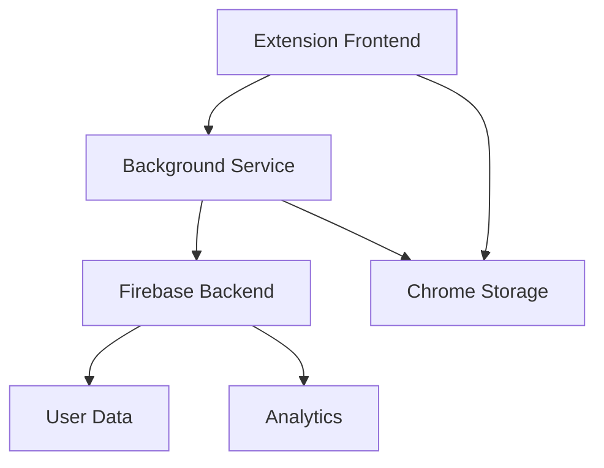
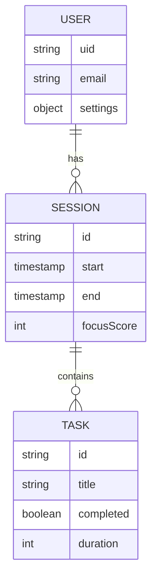
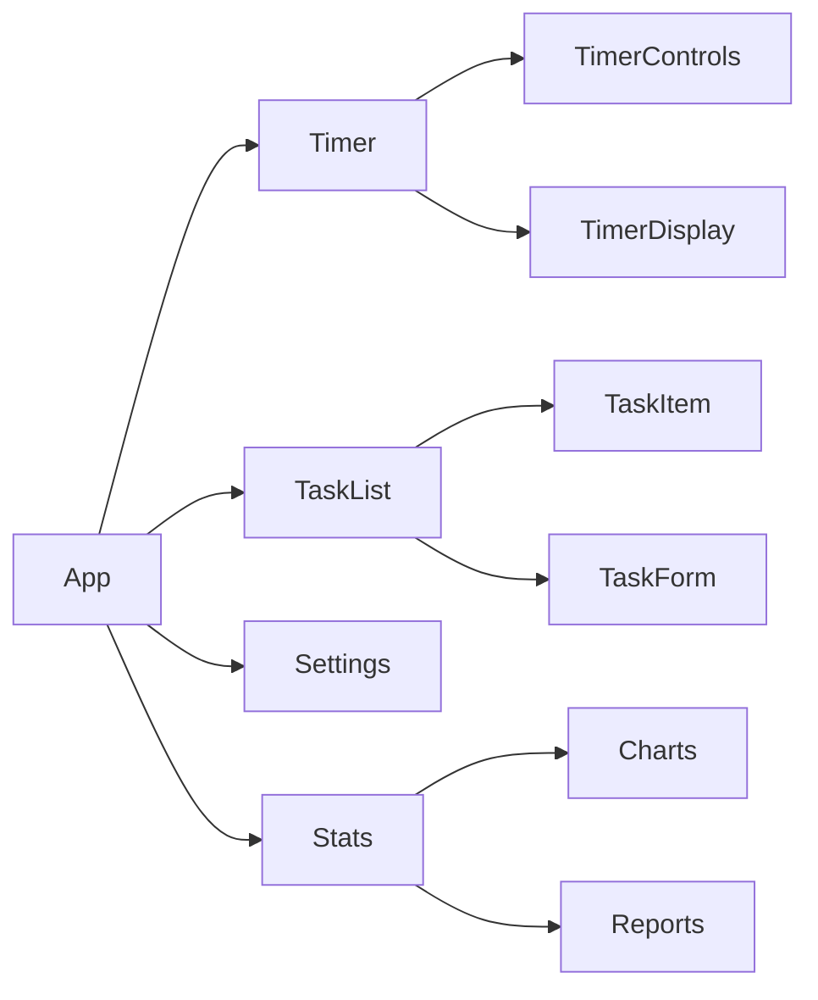

# FocusFlow Extension 🎯

Une extension de navigateur pour améliorer la productivité et maintenir la concentration.

## Fonctionnalités

- Timer Pomodoro configurable
- Blocage de sites distractifs
- Statistiques de focus
- Multi-navigateur (Chrome, Firefox, Edge)

## Architecture

## Structure des données

## Roadmap v2 🗺️

### Phase 1: Core Features - En cours ⏳
- [x] Multi-navigateur setup
- [x] Timer basique
- [x] UI minimaliste
- [ ] Service Worker
- [ ] Blocage de sites

### Phase 2: Améliorations UI
- [ ] Stats & Dashboard
- [ ] Theme support
- [ ] Notifications
- [ ] Import/Export

### Phase 3: Tests & Polish
- [ ] Tests E2E
- [ ] Tests unitaires
- [ ] Documentation API
- [ ] Store release

## Documentation

- [Installation](./docs/INSTALL.md)
- [Architecture](./docs/ARCHITECTURE.md)
- [TODO](./docs/TODO.md)

## Components Structure

License MIT

Copyright (c) 2025 nabz0r (nabz0r@gmail.com)
GitHub: https://github.com/nabz0r
