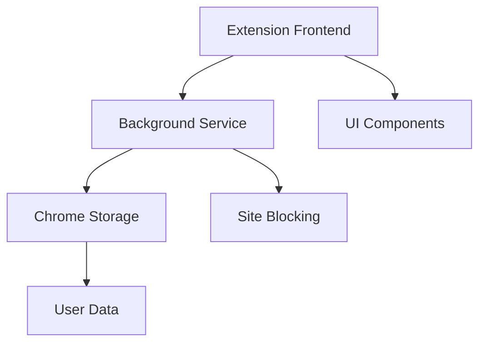

# FocusFlow Extension 🎯

Une extension de navigateur pour améliorer la productivité et maintenir la concentration.

## Architecture

## Roadmap v2 🗺️

### Phase 1: Core Backend (Sprint 1)
- [ ] Background Service Worker
- [ ] Timer Core Logic
- [ ] Chrome Storage Setup
- [ ] Basic Site Blocking

### Phase 2: Basic UI (Sprint 2)
- [ ] Timer Component
- [ ] Settings Panel
- [ ] Task Board v1
- [ ] Block List Manager

### Phase 3: Enhanced Features (Sprint 3)
- [ ] Pomodoro Logic
- [ ] Statistics Local
- [ ] Site Categories
- [ ] Settings Sync

### Phase 4: Firebase & Polish (Sprint 4)
- [ ] Firebase Setup
- [ ] User Auth
- [ ] Cloud Sync
- [ ] Analytics
- [ ] Store Release

License: MIT
