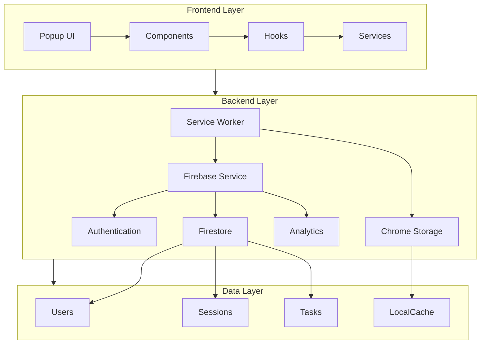
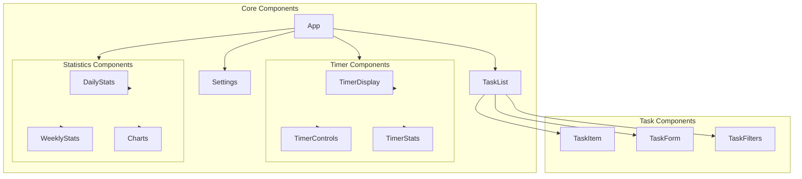
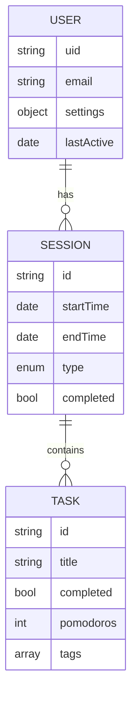
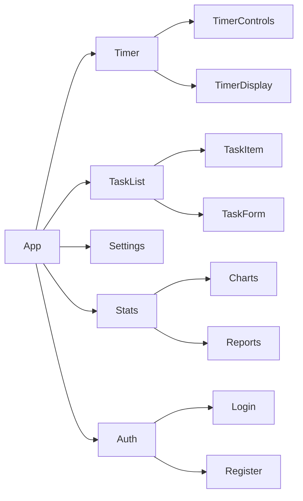

# 🎯 FocusFlow Extension

> Une extension de navigateur pour améliorer la productivité et maintenir la concentration.
>

[](https://buymeacoffee.com/nabz0r)

## ✨ Fonctionnalités

- 🕔 Timer Pomodoro configurable
- 🚫 Blocage de sites distractifs
- 📈 Statistiques de focus
- 🌐 Multi-navigateur (Chrome, Firefox, Edge)
- 🔥 Synchronisation Firebase
- 👥 Multi-utilisateurs avec auth
- 📊 Analytics temps réel

## 📊 État Actuel

| Feature | Status | Notes |
|---------|---------|-------|
| Timer Core | 🟢 **DONE** | Complet |
| UI Base | 🟢 **DONE** | React + TailwindCSS |
| Site Blocking | 🟢 **DONE** | Pattern matching |
| Notifications | 🟢 **DONE** | Custom sounds |
| Firebase | 🟡 IN PROGRESS | Auth + Firestore |
| Stats | 🟡 IN PROGRESS | Real-time sync |
| Settings | 🟡 IN PROGRESS | Multi-device |
| Tests | 🔴 NOT STARTED | Critique |

## 🛠️ Architecture v2

### System Architecture


### Component Architecture


## 📑 Data Structure

### Firebase Schema


## 🗺️ Roadmap v4

### Phase 1: Firebase Integration 🟡
- [x] Setup projet Firebase
- [x] Configuration auth
- [x] Schema Firestore
- [ ] Migration données
- [ ] Tests sync

### Phase 2: Core Features 🟢
- [x] Multi-navigateur setup
- [x] Timer basique + UI
- [x] Service Worker
- [x] Blocage de sites
- [x] Notifications

### Phase 3: Améliorations UX 🟡
- [ ] Stats & Dashboard
- [ ] Theme support
- [ ] Import/Export
- [ ] Raccourcis clavier
- [ ] Sync multi-device

### Phase 4: Tests & Polish 🔴
- [ ] Tests E2E
- [ ] Tests unitaires
- [ ] Tests Firebase
- [ ] Documentation API
- [ ] Store release

## 💻 Components



## 📖 Documentation

- [Installation](./docs/INSTALL.md)
- [Architecture](./docs/ARCHITECTURE.md)
- [Tasks](./docs/TASKS.md)

## 🔗 Liens Utiles

- 👨‍💻 [Code Source](https://github.com/nabz0r/focus-flow-extension)
- 📈 [Bug Tracker](https://github.com/nabz0r/focus-flow-extension/issues)
- 💬 [Discussions](https://github.com/nabz0r/focus-flow-extension/discussions)
- 🔥 [Firebase Console](https://console.firebase.google.com)

## 🚀 Getting Started

1. Clone et install deps
```bash
git clone https://github.com/nabz0r/focus-flow-extension.git
cd focus-flow-extension
npm install
```

2. Firebase setup
```bash
firebase login
firebase init
```

3. Dev mode
```bash
npm run dev
```

---

License: MIT

Copyright (c) 2025 nabz0r (nabz0r@gmail.com)
