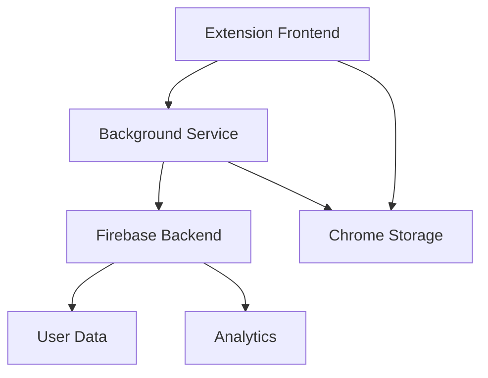
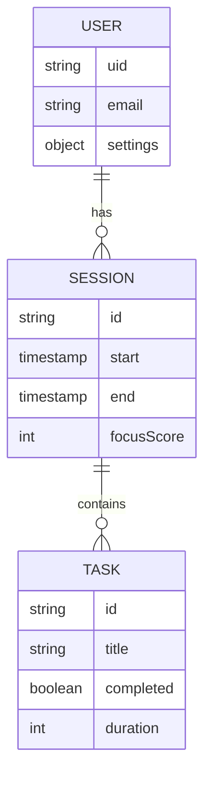

# FocusFlow Extension 🎯

Une extension de navigateur pour améliorer la productivité et maintenir la concentration.

## Architecture



## Structure des données



## Roadmap Technique 🗺️

### Phase 1: Core Extension (Sprint 1-2)
- [ ] Setup Extension Manifest V3
- [ ] Background Service Worker
- [ ] Basic UI Components (React)
- [ ] Timer Core Logic
- [ ] Site Blocking Basic

### Phase 2: User Features (Sprint 3-4)
- [ ] Firebase Integration
- [ ] User Authentication
- [ ] Settings Sync
- [ ] Task Management
- [ ] Statistics Tracking

### Phase 3: Advanced Features (Sprint 5-6)
- [ ] Pomodoro Timer
- [ ] Site Categories
- [ ] Analytics Dashboard
- [ ] Performance Metrics
- [ ] Browser Sync

### Phase 4: Polish & Deploy (Sprint 7-8)
- [ ] UI/UX Refinement
- [ ] Error Handling
- [ ] Testing Suite
- [ ] Performance Optimization
- [ ] Chrome Web Store Prep

## Components Structure

```mermaid
graph LR
    A[App] --> B[Timer]
    A --> C[TaskList]
    A --> D[Settings]
    A --> E[Stats]
    B --> F[TimerControls]
    B --> G[TimerDisplay]
    C --> H[TaskItem]
    C --> I[TaskForm]
    E --> J[Charts]
    E --> K[Reports]
