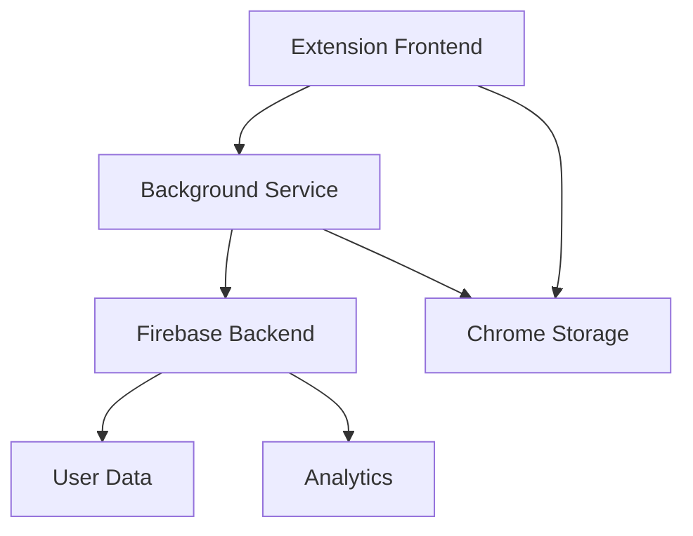
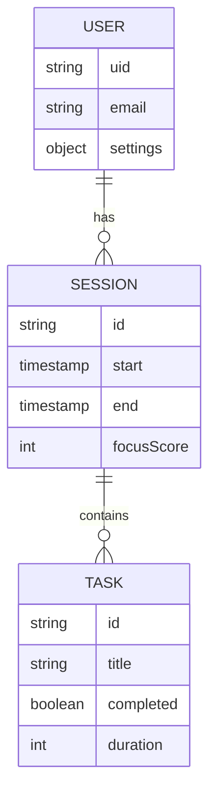
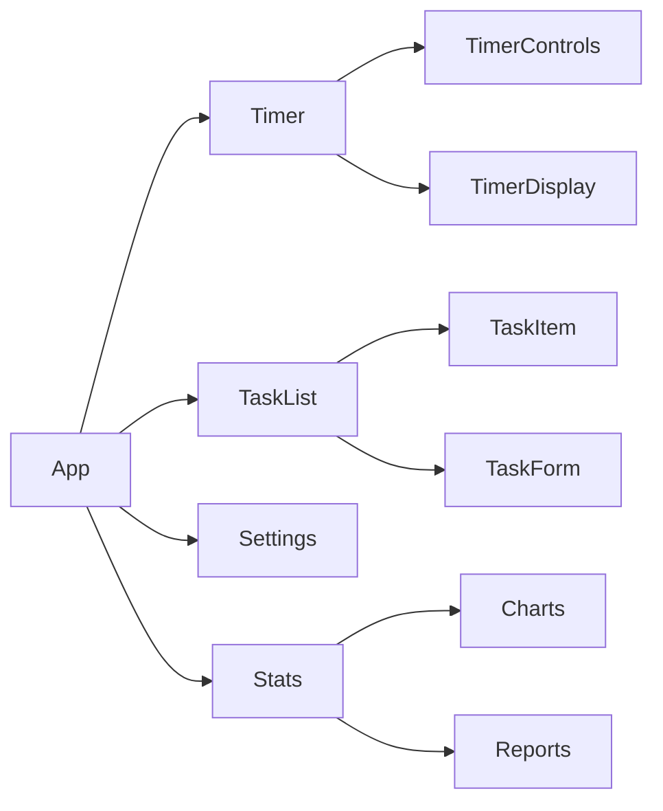

# 🎯 FocusFlow Extension

> Une extension de navigateur pour améliorer la productivité et maintenir la concentration.

## ✨ Fonctionnalités

- 🕔 Timer Pomodoro configurable
- 🚫 Blocage de sites distractifs
- 📈 Statistiques de focus
- 🌐 Multi-navigateur (Chrome, Firefox, Edge)

## 📊 État Actuel

| Feature | Status |
|---------|--------|
| Timer Core | 🟢 **DONE** |
| UI Base | 🟢 **DONE** |
| Site Blocking | 🟢 **DONE** |
| Notifications | 🟢 **DONE** |
| Stats | 🟡 TODO |
| Settings | 🟡 TODO |
| Tests | 🔴 NOT STARTED |

## 🛠️ Architecture

## 📑 Structure des données

## 🗺️ Roadmap v3

### Phase 1: Core Features 🟢
- [x] Multi-navigateur setup
- [x] Timer basique + UI
- [x] Service Worker
- [x] Blocage de sites
- [x] Notifications

### Phase 2: Améliorations UX 🟡
- [ ] Stats & Dashboard
- [ ] Theme support
- [ ] Import/Export
- [ ] Raccourcis clavier

### Phase 3: Tests & Polish 🔴
- [ ] Tests E2E
- [ ] Tests unitaires
- [ ] Documentation API
- [ ] Store release

## 💻 Components

## 📖 Documentation

- [Installation](./docs/INSTALL.md)
- [Architecture](./docs/ARCHITECTURE.md)
- [Tasks](./docs/TASKS.md)

## 🔗 Liens Utiles

- 👨‍💻 [Code Source](https://github.com/nabz0r/focus-flow-extension)
- 📈 [Bug Tracker](https://github.com/nabz0r/focus-flow-extension/issues)
- 💬 [Discussions](https://github.com/nabz0r/focus-flow-extension/discussions)

---

License: MIT

Copyright (c) 2025 nabz0r (nabz0r@gmail.com)