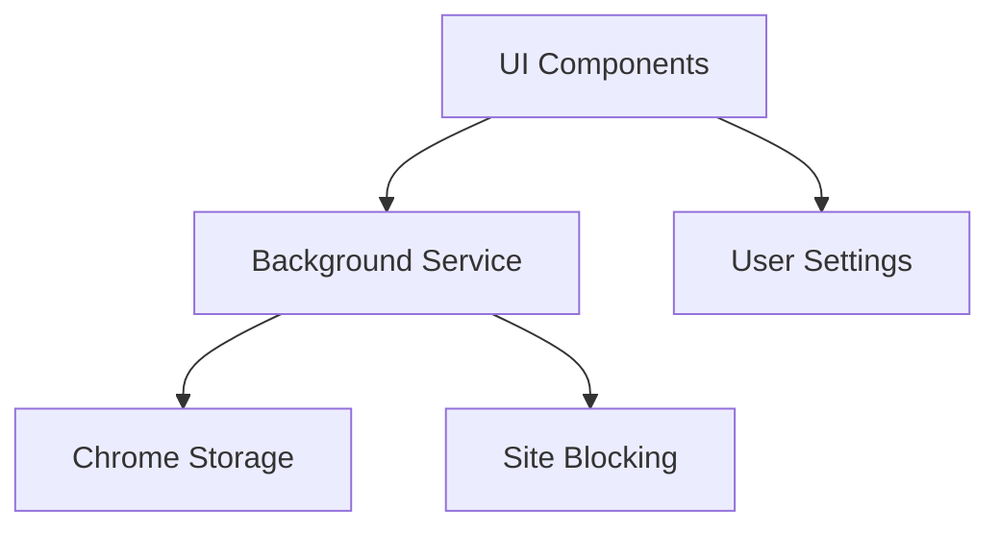

# Architecture FocusFlow

## Structure du Projet

```
/src
  /assets        - Icons et ressources
  /background    - Service worker & blocage de sites
  /components    - Composants React
    /Timer       - Gestion du timer
    /Sites       - Gestion des sites bloqués
  /utils         - Utilitaires partagés
  manifest.json  - Configuration navigateurs
```

## Flux de Données



## État de l'Application

- Timer state: service worker
- Settings: chrome.storage.local
- Blocked sites: chrome.storage.local

## Communication

- UI → Background: chrome.runtime.sendMessage
- Background → UI: chrome.runtime.onMessage