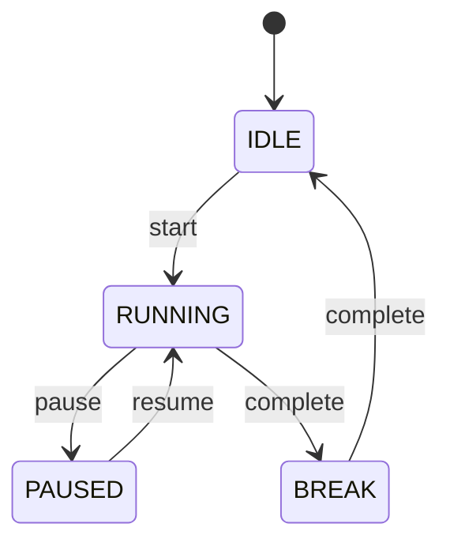
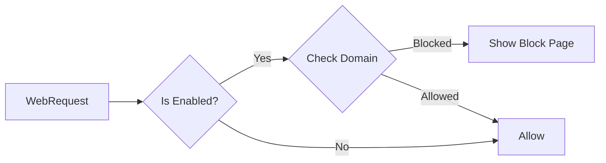
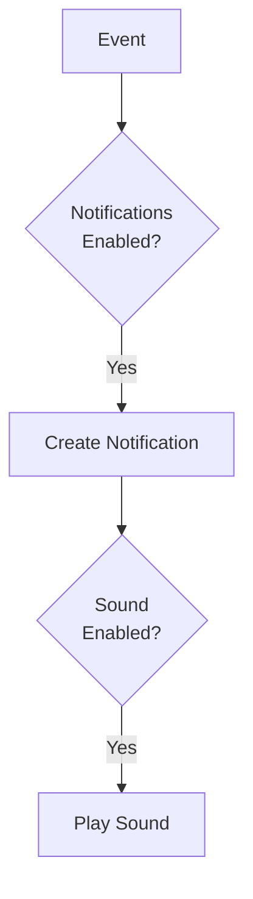
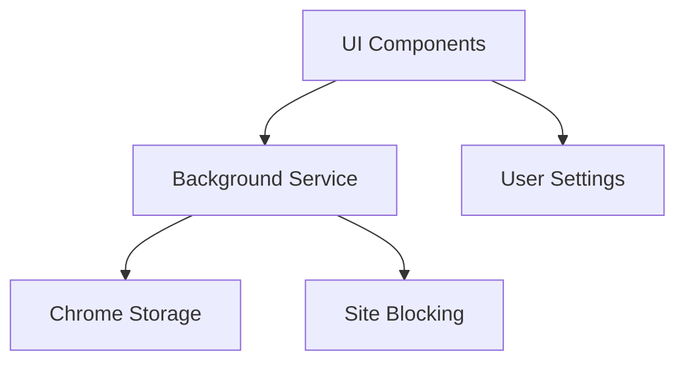

# 🛠️ Architecture FocusFlow

## Structure du Projet

```
/src
  ├── /assets        - Icons & resources
  ├── /background    - Core logic
  │   ├── service-worker.ts
  │   ├── timer-core.ts    ✅
  │   ├── site-blocker.ts  ✅
  │   └── notifications.ts ✅
  ├── /components    - React UI
  │   ├── /Timer          ✅
  │   ├── /Sites          ✅
  │   ├── /Stats          ⏳
  │   └── /Settings       ⏳
  └── /utils         - Helpers
```

## Core Services

### Timer Core ✅


### Site Blocker ✅


### Notifications ✅


## Storage

### Chrome Storage Schema
```typescript
interface Storage {
  settings: {
    timer: TimerConfig;
    notifications: NotificationSettings;
    theme: ThemeConfig;
  };
  blockedSites: string[];
  sessions: Session[];
}
```

## Flux de données



## Légende
- ✅ Implémenté
- ⏳ En cours
- ❌ Non commencé